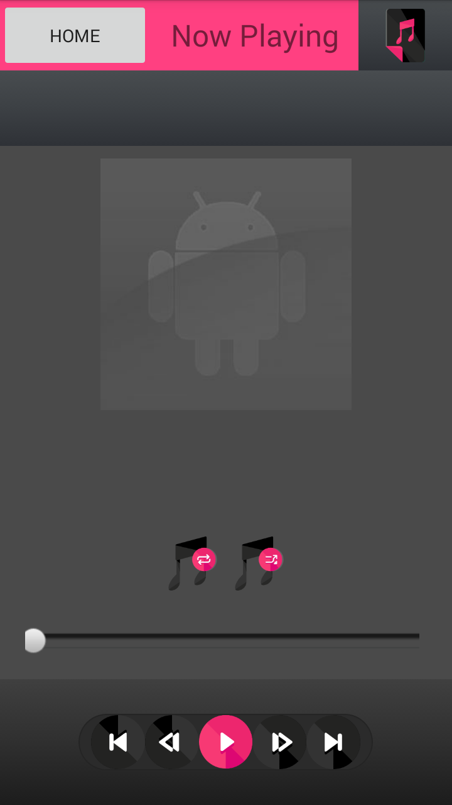
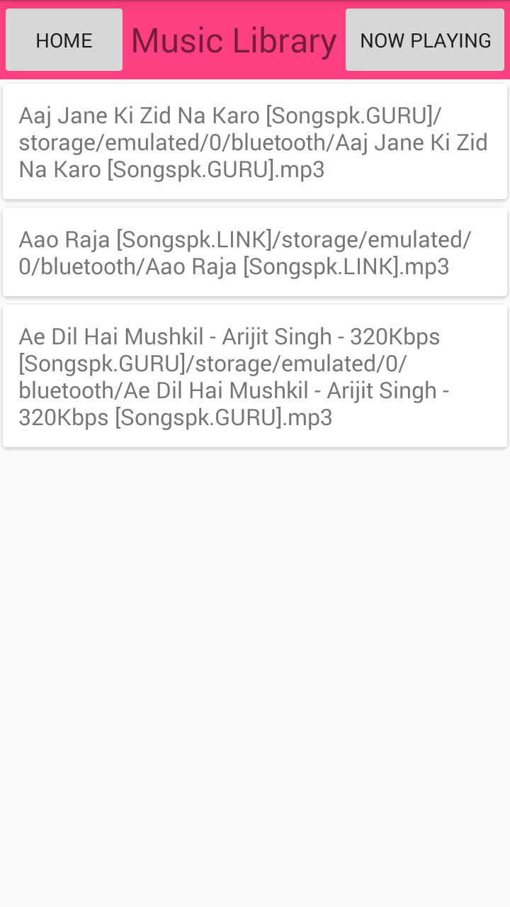

## MusicalStructureApp
The structure of a Music app which would allow a user to play audio files.
Project which comes under Udacity Android Basics Nanodegree Program

## Project Overview
This project is to combine and practice everything you learned in program. You will be making the structure of a music app using intents and empty activities.
The goal is to design and create the structure of a Music app which would allow a user to play audio files. There are many music player apps, and they make a wide variety of design choices. It will be your job to decide what kind of music app your structure would turn into and build out that structure using intents. Will you build an app to play music from the user’s library of music? Will you build an app to stream random songs from a database? Will you build a musical suggestion engine? Those choices are up to you!

## What will i learn?
This project is about combining various ideas and skills we’ve been practicing throughout the course. They include:

1. Designing an app experience to achieve a certain goal
2. Creating new activities
3. Using explicit Intents to link between activities in your app.
4. Using OnClickListeners to add behavior to buttons using Java code.

## Requirements
Select a potential structure and create an app with that structure in Android Studio. Your app should have 3 to 6 Activities. Some ideas for Activities would be:

1. "Now playing" screen
2. List artists, albums, playlists, or podcasts
3. Detail screen or screens for individual artists, albums, or podcasts
4. Store screen for buying music online
5. Search screen

Each Activity should contain a TextView which tells a user the point of the screen, and what technical hurdles there are to implementing the screen. You should also add a collection of buttons indicating what Activities can be reached from the current one. Use OnClickListener objects to make your buttons change Activity using Intents.

## Final Output - Screenshots

Screen 1                          |Screen 2
:--------------------------------:|:--------------------------------:
  |

## Download
You can download the apk here [MusicalStructureApp](../../raw/master/app/screenshots/app-debug.apk)
